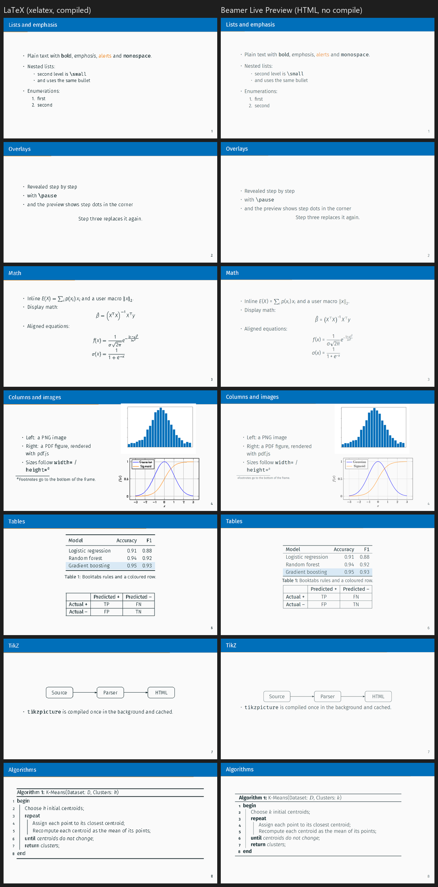

# Beamer Live Preview

**A Marp-style live preview for LaTeX beamer slides in VS Code, without compiling.**

The extension parses your `.tex` source directly and renders every frame as HTML/CSS that mimics the
[metropolis](https://github.com/matze/mtheme) theme. It follows the cursor, updates as you type
(unsaved changes included) and takes about 100 ms for a typical lecture. It is not pixel-perfect TeX,
but it is close enough to judge bullets, images, math and layout while you write.



*Left: the demo deck compiled with XeLaTeX. Right: the same source in the preview, with no LaTeX run.
Generated from [`examples/demo`](examples/demo).*

## Why

Writing beamer slides usually means edit → compile (seconds) → find the page in the PDF → repeat.
Existing options all have a catch:

| Approach | Catch |
|---|---|
| LaTeX Workshop + `latexmk` on save | Real output, but a full XeLaTeX + TikZ build takes seconds per change |
| [TeXpresso](https://github.com/let-def/texpresso) | Incremental live TeX, but no native Windows build and a separate window |
| Rewrite in Marp / Slidev / Typst ([Touying](https://github.com/touying-typ/touying)) | Instant preview, but you have to leave LaTeX |
| LaTeX.js / pandoc → HTML | No beamer: frames, overlays and theme are lost |

This extension takes a different trade-off. It covers the subset of LaTeX that slides actually use
(on the author's 480-frame course: lists, emphasis, math, images, columns, blocks and tables) and
renders it instantly. The rare constructs HTML cannot approximate (TikZ, pgfplots, algorithm2e) are
compiled once with real LaTeX in the background and cached.

## Features

- **Live and fast.** Re-renders on every keystroke (debounced). Measured: 47 slides in about 80 ms, 495 slides in about 210 ms.
- **Cursor sync both ways.** The preview scrolls to the frame under the cursor and selects the overlay step that shows the current line.
  Clicking a slide jumps to its source line.
- **Lecture mode.** Open an included file (`\subimport`, `\input`, `\include`) and the preview finds the root document
  (via `%!TEX root = …` or by searching parent folders). It shows the root's title page, the section page and only that
  file's frames, like a per-lecture PDF.
- **Theme from your preamble.**
  - `\metroset{progressbar=…, block=fill, numbering=…, sectionpage=…, background=…}`
  - `\setbeamercolor{frametitle|palette primary|alerted text|example text|…}`
  - `\definecolor`, `\colorlet`, and xcolor expressions such as `brand!50!black`, `\arrayrulecolor`, `\setbeamertemplate{frame footer}`
- **Overlays.** `\pause`, `\only<>`, `\uncover<>`, `\visible<>`, `\invisible<>`, `\alt<>`, `\onslide`, `\item<2->`, `[<+->]`,
  `\includegraphics<2>`, `overprint`. Show the final step, the first step, or every step as its own slide (like the PDF).
- **Content.**
  - Lists: itemize, enumerate, description (with `\setlength{\itemsep}` and size switches).
  - Layout: `columns`/`column`, `minipage`, `multicols`, `center`, `\resizebox`, `\scalebox`.
  - Blocks: `block`, `alertblock`, `exampleblock` and theorem-like environments.
  - Floats: `figure`/`table` with numbered captions.
  - Tables: `tabular` with `|`, `\hline`, booktabs rules, `\multicolumn`, `\multirow`, `\rowcolor`, `\cellcolor`.
  - Footnotes: `\footnote` (lettered inside columns) and `\blfootnote`.
  - Also `verbatim`, `\href`, `\url`, and user `\newcommand`/`\def`/`\newenvironment` (expanded).
- **Math** with [KaTeX]. User macros and `\DeclareMathOperator` are passed through. Letters use the sans text font,
  like beamer's default math.
- **Images.** PNG, JPG and SVG are shown directly, PDF figures through [pdf.js]. `\animategraphics` animates.
- **TikZ, pgfplots, algorithm2e.** Compiled in the background with real LaTeX, using your preamble's packages, colours,
  macros and `\tikzstyle`s, then cached by content hash.
  - Engines: Docker (`texlive/texlive`, default) or a local `pdflatex`.
  - Until a snippet is ready, or with the engine `off`, you see a placeholder (TikZ) or an HTML approximation (algorithm2e).
- **Present mode.** Press `P`/`F5` or click ▶, then use the arrow keys or space to step through overlays. `Esc` leaves.
- **1–4 column grid** for an overview of the deck.

## Installation

### From a release

Download `beamer-preview-<version>.vsix` from the [Releases](https://github.com/jplatos/beamer-preview/releases) page, then:

```sh
code --install-extension beamer-preview-<version>.vsix
```

### From source

```sh
git clone https://github.com/jplatos/beamer-preview.git
cd beamer-preview
npm install
npm run package          # creates beamer-preview-<version>.vsix
code --install-extension beamer-preview-*.vsix
```

To hack on it, open the folder in VS Code and press `F5` (Run Extension).

## Usage

1. Open a `.tex` file.
2. Run **Beamer: Open Beamer Preview to the Side** from the editor title button (preview icon), `Ctrl+K B`
   (`Cmd+K B` on macOS) or the Command Palette.
3. Edit. The preview follows.

In the preview toolbar:

- **Layout** shows 1–4 slides per row.
- **Overlays** shows the final step, the first step, or every step.
- Click the numbered dots on a slide to switch its overlay step.
- Double-click a slide to present from it.

### Static HTML export

The same renderer is available from the command line. This is handy for sharing a quick preview or for debugging:

```sh
node cli.js path/to/slides.tex -o preview.html            # lecture mode for included files
node cli.js path/to/main.tex  -o preview.html --document  # whole document
node cli.js path/to/main.tex  -o preview.html --snippets  # also compile TikZ & co. (Docker)
```

## Settings

| Setting | Default | Description |
|---|---|---|
| `beamerPreview.scope` | `file` | `file`: lecture mode for included files. `document`: always the whole root document |
| `beamerPreview.followActiveEditor` | `true` | Switch the preview when another `.tex` editor becomes active |
| `beamerPreview.syncCursor` | `true` | Scroll to the frame (and overlay step) under the cursor |
| `beamerPreview.debounceMs` | `250` | Delay after typing before re-rendering |
| `beamerPreview.snippets.engine` | `docker` | `docker`, `local` (`pdflatex` on PATH) or `off` |
| `beamerPreview.snippets.dockerImage` | `texlive/texlive:latest` | Image used by the `docker` engine |

The **Beamer: Clear LaTeX Snippet Cache** command deletes the compiled snippet cache.

## Requirements

- VS Code 1.85 or newer.
- Optional: Docker or a TeX distribution, for TikZ, pgfplots and algorithm2e. Everything else needs nothing beyond the extension.

## Limitations

- This is an approximation, not TeX. Line breaks, exact vertical spacing and overfull boxes can differ.
  Glyph details in math differ because KaTeX fonts are used for symbols.
- Only commonly used commands are supported. Unknown commands are dropped and their text is kept.
  The toolbar shows a count of these notes; hover over it for details.
- The theme is metropolis. Other beamer themes render with metropolis styling.
- Fonts are Fira Sans and Fira Mono (bundled), as in metropolis with XeLaTeX or LuaLaTeX.

## How it works

See [docs/ARCHITECTURE.md](docs/ARCHITECTURE.md). In short: a small TeX tokenizer feeds a renderer that walks the
document. The renderer expands user macros and turns each frame into HTML; a webview then lays out, scales and steps
through the slides.

## Development

```sh
npm install
npm test                 # smoke tests on examples/demo (no browser needed)
npm run test:vscode      # integration test in a downloaded VS Code
npm run export -- examples/demo/main.tex -o demo.html --document
npm run screenshots -- demo.html shots/ all   # needs Chrome/Edge (or CHROME_PATH)
```

## License

[MIT](LICENSE) © Jan Platoš

Bundles [KaTeX] (MIT), [pdf.js] (Apache-2.0), and Fira Sans and Fira Mono via [Fontsource](https://fontsource.org) (SIL OFL 1.1).

[KaTeX]: https://katex.org
[pdf.js]: https://mozilla.github.io/pdf.js/
